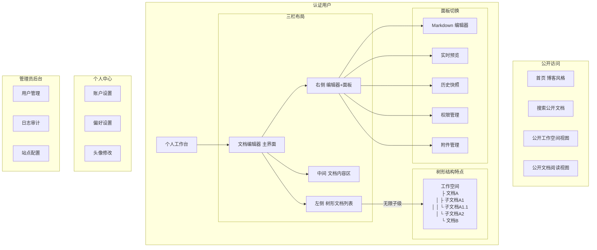
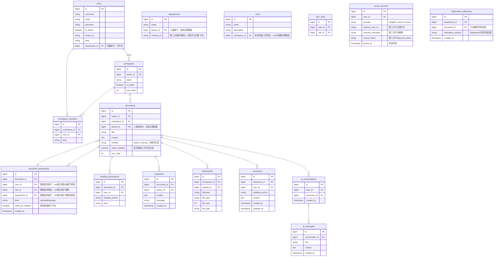
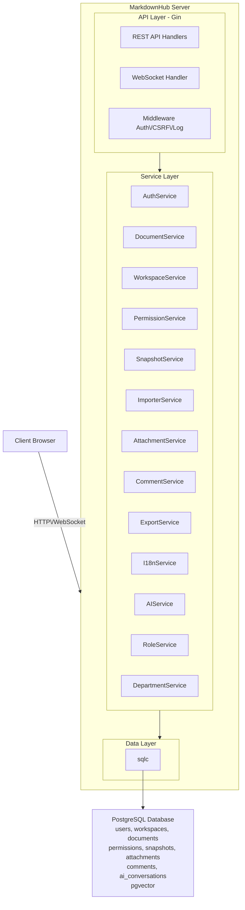

# MarkdownHub 产品需求文档 (PRD)

| 版本 | 日期 | 作者 | 说明 |
|------|------|------|------|
| v1.0 | 2026-03-20 | PM | 初始版本 |
| v1.1 | 2026-03-20 | PM | 新增执行摘要 |
| v1.2 | 2026-03-20 | PM | 新增问题陈述、用户故事、Out of Scope |
| v1.3 | 2026-03-20 | PM | 修复章节结构、补充里程碑规划、评论/PDF/i18n/AI功能 |
| v1.4 | 2026-03-20 | PM | ASCII图表转换为Mermaid格式 |
| v1.5 | 2026-03-20 | PM | 附件跨文档引用、树形文档结构（无限子级） |
| v1.6 | 2026-03-20 | PM | 树形节点权限分配（用户/角色/部门授权+继承控制） |
| v1.7 | 2026-03-20 | PM | 节点可见性控制（公开/内部+继承控制） |
| v1.8 | 2026-03-20 | PM | 节点权限一键清除功能 |
| v1.9 | 2026-03-20 | PM | 第三方登录绑定（钉钉/企业微信/飞书） |
| v1.10 | 2026-03-20 | PM | 首次第三方登录强制完善账号信息 |

---

## 1. 执行摘要

**MarkdownHub** 面向研发团队、渗透测试红队、技术写作者、内容团队、知识管理者及产品经理，提供纯 Markdown 格式的**实时同步协作编辑平台**。解决当前市场上缺乏同时支持**标题级权限控制**与**私有化部署**的企业级协作工具的痛点，使团队能够安全地共享内容并实现高效的内部知识流转。产品同时支持**自动同步钉钉、企业微信、飞书组织架构**、**便捷的附件管理**（文档内附加压缩包等额外资源），以及后期接入 **OpenAI 兼容 AI 接口**实现**"Ask AI"智能问答、AI文档补全、内容总结、内容缩写与扩写**等能力。预期上线后将显著改善企业内部内容分发与信息同步效率，助力研发、销售、售前等多部门协作认知对齐，并将成为企业私有化知识库基础设施。

---

## 2. 问题陈述

### 谁有这个问题？
研发团队、渗透测试红队、技术写作者、内容团队、知识管理者、产品经理，以及中小型团队或初创公司。

### 具体是什么问题？
1. **协作版本冲突**：多人同时编辑文档时，各自手上的版本不一致，无法保证文档信息的及时性和一致性。
2. **缺乏合适工具**：市场上缺乏纯 Markdown 格式、支持实时同步协作、同时具备标题级权限控制的平台；现有多数协作工具（如 Confluence、Notion）为 SaaS 收费模式，不适合中小型团队或初创公司使用。
3. **信息不对称**：企业内部研发已产出成果，但销售、售前等部门无法及时了解产品功能点及相关进度。

### 为什么痛苦？
- **商业损失**：信息不同步导致错失商业机会
- **知识流失**：拖慢研发团队的知识提升进度
- **协作低效**：文档版本混乱导致重复劳动和沟通成本增加
- **成本负担**：付费工具增加中小团队经济压力

### 证据
实际工作中，部门间信息不同步已造成商业机会流失和研发知识积累受阻等问题，亟需一个支持私有化部署的企业级协作平台来解决。

---

## 3. 产品概述

### 3.1 产品定义

**MarkdownHub** 是一个实时协作的 Markdown 文档写作环境。它结合了实时 WebSocket 协作与自动版本控制快照，以及精细的标题级别权限管理。

### 3.2 核心价值主张

| 价值点 | 描述 |
|--------|------|
| **实时协作** | 多人同时编辑，毫秒级同步 |
| **版本控制** | 自动快照与历史管理 |
| **精细权限** | 精确到标题级别的权限控制 |
| **Markdown 原生** | 纯文本存储，数据可迁移 |
| **内容发现** | 博客风格公开主页，支持内容检索 |

### 3.3 差异化优势

1. **标题级权限**: 市面上唯一支持精确到 Markdown 标题级别权限的协作平台
2. **版本完整**: 纯文本存储，版本历史完整可追溯
3. **启发式快照**: 智能判断自动创建快照的时机，无需手动操作

---

## 4. 目标用户与场景

### 4.1 目标用户画像

| 用户类型 | 特征 | 使用场景 |
|----------|------|----------|
| **技术写作者** | 熟悉 Markdown，追求简洁 | 编写技术文档、API 文档 |
| **内容团队** | 需要协作，权限敏感 | 多人编辑同一文档，不同章节由不同人负责 |
| **知识管理者** | 注重版本历史 | 建立知识库，需要追溯修改记录 |
| **产品经理** | 需要精细权限 | 编写 PRD，可限制他人只能查看或编辑特定章节 |
| **教育机构** | 公开分享场景 | 创建公开课程资料，支持公开/私有切换 |

### 4.2 核心使用场景

#### 场景 1：技术文档协作
```
场景：开发团队编写 API 文档
用户：Alice（后端）、Bob（前端）、Carol（技术负责人）
流程：
1. Carol 创建 "API 文档" 工作空间
2. Alice 负责 "认证接口" 章节
3. Bob 负责 "数据模型" 章节
4. Carol 设置 Alice 和 Bob 只能编辑各自负责的章节
5. Alice 和 Bob 同时编辑各自的章节，互不干扰
6. Carol 可查看和编辑全部内容
```

#### 场景 2：知识库管理
```
场景：个人知识管理
用户：David（知识管理者）
流程：
1. David 创建多个工作空间（技术笔记、产品思考、生活感悟）
2. 启用公开状态分享优质内容
3. 每次修改自动产生版本快照
4. 需要时回溯到历史版本
```

#### 场景 3：内容导入与迁移
```
场景：从其他平台迁移内容
用户：Eve（从 Medium 迁移）
流程：
1. Eve 安装浏览器插件
2. 打开 Medium 文章，点击插件图标
3. 选择目标工作空间
4. 自动转换为 Markdown 并导入
5. 图片自动下载并上传为附件
```

---

## 5. 信息架构

### 5.1 产品结构



### 5.2 页面路由

| 路由 | 页面 | 访问权限 |
|------|------|----------|
| `/` | 首页 | 公开 |
| `/login` | 登录页 | 公开 |
| `/register` | 注册页 | 公开 |
| `/me` | 个人中心 | 登录用户 |
| `/documents` | 文档编辑器 | 登录用户 |
| `/documents/:id/view` | 文档只读视图 | 文档权限用户 |
| `/public/workspaces/:id` | 公开工作空间 | 公开 |
| `/public/docs/:id` | 公开文档 | 公开 |
| `/admin` | 管理后台 | 管理员 |

---

## 6. 功能需求

### 6.1 用户与认证

#### 4.1.1 用户注册
- 用户名（唯一，长度 3-20 字符）
- 邮箱（可选，用于找回密码）
- 密码（长度 >= 6 字符）

#### 4.1.2 用户登录
- 用户名/邮箱 + 密码登录
- JWT Token 认证
- 登录状态保持

#### 4.1.3 个人中心
| 功能 | 描述 |
|------|------|
| 修改密码 | 修改登录密码 |
| 更新邮箱 | 更新绑定邮箱 |
| 设置偏好语言 | 设置界面语言（简体中文/繁体中文/英文） |
| 上传头像 | 上传或修改头像 |

#### 4.1.4 第三方登录绑定
| 功能 | 描述 |
|------|------|
| 绑定钉钉 | 已注册用户可绑定钉钉账号，使用钉钉扫码登录 |
| 绑定企业微信 | 已注册用户可绑定企业微信，使用企业微信扫码登录 |
| 绑定飞书 | 已注册用户可绑定飞书账号，使用飞书扫码登录 |
| 解绑第三方 | 可解除第三方账号绑定（需保留密码登录方式） |
| 绑定状态显示 | 显示已绑定的第三方账号列表 |
| 登录优先级 | 第三方登录优先使用绑定的账号 |

#### 4.1.5 首次第三方登录账号完善
| 功能 | 描述 |
|------|------|
| 强制完善信息 | 通过第三方登录首次注册的用户，必须设置用户名和密码 |
| 用户名唯一性 | 用户名全局唯一，不可与已注册用户名重复 |
| 密码要求 | 密码长度 >= 6 字符 |
| 完善后才可用 | 未完善用户名密码前，仅能使用第三方登录，无法使用其他功能 |
| 引导界面 | 首次登录后弹出引导界面，提示完善账号信息 |

### 6.2 工作空间

#### 4.2.1 工作空间管理
| 功能 | 描述 |
|------|------|
| 创建工作空间 | 输入名称创建，默认私有 |
| 编辑工作空间 | 修改名称 |
| 删除工作空间 | 确认后删除，包含所有文档 |
| 拖拽排序 | 调整工作空间显示顺序 |
| 设置公开 | 切换公开/私有状态 |

#### 4.2.2 左侧树形结构
| 功能 | 描述 |
|------|------|
| 树形展示 | 工作空间内文档以树形结构展示 |
| 无限子级 | 支持文档下创建子文档，子文档下可再创建子文档 |
| 节点类型 | 树节点可以是文档（Document），没有"文件夹"概念 |
| 展开/折叠 | 支持节点展开和折叠 |
| 拖拽排序 | 支持拖拽调整节点顺序和层级 |
| 扁平化视图 | 提供切换到扁平列表视图的选项 |

#### 4.2.3 子文档管理
| 功能 | 描述 |
|------|------|
| 创建子文档 | 在任意文档下创建子文档 |
| 层级显示 | 子文档在父文档下方缩进显示 |
| 路径导航 | 显示文档的完整层级路径 |
| 批量操作 | 支持对父文档及其所有子文档进行操作 |

#### 4.2.4 工作空间成员
| 功能 | 描述 |
|------|------|
| 添加成员 | 通过用户名添加 |
| 设置权限级别 | read / edit / manage |
| 移除成员 | 移除后该用户失去访问权限 |
| 查看成员列表 | 查看所有成员及权限 |

### 6.3 文档管理

#### 4.3.1 文档 CRUD
| 功能 | 描述 |
|------|------|
| 创建文档 | 在工作空间内创建 Markdown 文档 |
| 编辑文档 | 修改标题和内容 |
| 删除文档 | 确认后删除 |
| 拖拽排序 | 调整文档显示顺序 |
| 设置公开 | 切换公开/私有状态 |

#### 4.3.2 文档编辑
| 功能 | 描述 |
|------|------|
| Markdown 编辑 | 左侧文本编辑区 |
| 实时预览 | 右侧渲染后的 HTML 预览 |
| 光标同步 | 编辑器光标位置同步到预览区 |
| 自动保存 | 实时保存到服务器 |
| 标题提取 | 自动提取文档中的所有标题 |

#### 4.3.3 实时协作
| 功能 | 描述 |
|------|------|
| WebSocket 连接 | 多人同时编辑同一文档 |
| 内容同步 | 行级差异同步 |
| 冲突处理 | 服务端按时间戳合并 |
| 协作指示 | 显示当前在线用户 |

### 6.4 权限系统

#### 4.4.1 权限级别
| 级别 | 能力 |
|------|------|
| **read** | 只读访问，可查看内容 |
| **edit** | 可编辑内容 |
| **manage** | 可编辑 + 设置权限 + 删除 + 修改公开状态 |

#### 4.4.2 权限层级
权限检查优先级（高到低）：
1. 管理员（Admin）→ 所有权限
2. 文档所有者 → 所有权限
3. 工作空间成员权限
4. 文档/节点直接授权权限
5. 标题级权限（仅对标题下内容生效）

#### 4.4.3 树形节点权限分配
| 功能 | 描述 |
|------|------|
| 节点级授权 | 可将文档树中的任意节点（文档）共享给用户、角色或部门 |
| 授权对象 | 支持用户、角色（自定义角色）、部门（组织架构） |
| 权限级别 | 可设置 read / edit / manage 权限 |
| 继承控制 | 可选择子节点是否继承此权限设定 |
| 继承覆盖 | 子节点可单独设置权限覆盖父节点继承的权限 |
| 权限叠加 | 用户同时有多个级别的权限时取最高 |

#### 4.4.4 继承规则
| 场景 | 行为 |
|------|------|
| 父节点设置权限，子节点选择"继承" | 子节点自动继承父节点的所有权限 |
| 父节点设置权限，子节点选择"不继承" | 子节点仅保留工作空间级权限，无节点级权限 |
| 父节点继承，子节点单独设置 | 子节点权限以单独设置的为准 |
| 删除父节点权限 | 子节点继承链断开，子节点恢复默认继承状态 |

#### 4.4.5 节点可见性控制
| 类型 | 可见范围 | 说明 |
|------|---------|------|
| **公开 (public)** | 所有人（含未登录用户） | 公开主页可见，搜索引擎可索引 |
| **内部 (internal)** | 仅登录用户 | 需要登录后才能查看 |

| 功能 | 描述 |
|------|------|
| 可见性设置 | 可设置节点为公开或内部 |
| 继承控制 | 可选择子节点是否继承父节点的可见性设置 |
| 强制覆盖 | 子节点可单独设置可见性，覆盖父节点继承的值 |
| 工作空间影响 | 工作空间公开状态不影响文档可见性，以文档自身设置为准 |

#### 4.4.6 节点权限一键清除
| 功能 | 描述 |
|------|------|
| 清除节点权限 | 一键清除节点的所有权限设置（用户/角色/部门授权） |
| 恢复默认继承 | 清除后节点自动继承父节点的权限和可见性设置 |
| 包含可见性 | 同时清除可见性设置，恢复为继承父节点 |
| 权限范围 | 仅清除当前节点权限，不影响子节点 |
| 操作确认 | 清除操作需要二次确认，防止误操作 |

#### 4.4.7 标题级权限
| 功能 | 描述 |
|------|------|
| 设置标题权限 | 指定用户对特定标题下内容的编辑权限 |
| 继承规则 | 子标题继承父标题权限 |
| 权限叠加 | 用户同时有多个级别的权限时取最高 |

### 6.5 版本控制（快照）

#### 4.5.1 快照触发条件
| 条件 | 阈值 |
|------|------|
| 行数变化 | > 20 行 |
| 字节变化 | > 2048 字节 |
| 时间间隔 | > 5 分钟 |

#### 4.5.2 快照管理
| 功能 | 描述 |
|------|------|
| 创建快照 | 手动创建快照 |
| 列出快照 | 查看历史快照列表 |
| 预览快照 | 查看快照内容 |
| 恢复快照 | 将文档恢复到指定快照 |
| 对比差异 | 查看两个快照之间的差异 |
| 快照配置 | 管理员可修改触发阈值 |

### 6.6 附件管理

#### 4.6.1 上传附件
| 功能 | 描述 |
|------|------|
| 文件上传 | 支持图片、文档、压缩包等文件 |
| 粘贴上传 | 直接粘贴图片 |
| 拖拽上传 | 拖拽文件到编辑区 |
| 存储位置 | 附件归属于上传者，存储在工作空间级别 |

#### 4.6.2 附件引用
| 功能 | 描述 |
|------|------|
| 默认跟随文档 | 上传附件时自动关联当前编辑的文档 |
| 跨文档引用 | 上传者可将同一附件引入到不同文档 |
| Markdown 引用 | 上传后自动生成 Markdown 引用语法 |
| 预览显示 | 预览中显示图片等可预览文件 |

#### 4.6.3 附件管理界面
| 功能 | 描述 |
|------|------|
| 引用列表 | 显示附件被哪些文档引用 |
| 引用来源 | 每个引用显示文档名称和引用位置 |
| 移除引用 | 可移除附件与某文档的关联（非删除文件） |
| 引用统计 | 显示被引用次数和引用文档列表 |
| 权限控制 | 只有附件上传者可管理引用关系 |

### 6.7 内容导入

#### 4.7.1 URL 导入
| 功能 | 描述 |
|------|------|
| 输入 URL | 输入要导入的网页地址 |
| HTML 抓取 | 自动获取页面 HTML |
| Markdown 转换 | 使用 html-to-markdown 转换 |
| 图片处理 | 下载远程图片并重新上传 |
| 创建文档 | 在指定工作空间创建文档 |

#### 4.7.2 HTML 内容导入
| 功能 | 描述 |
|------|------|
| 直接粘贴 HTML | 输入 HTML 代码 |
| 批量转换 | 一次性转换多篇内容 |
| 浏览器插件 | 一键导入当前页面 |

### 6.8 搜索功能

#### 4.8.1 搜索范围
| 用户类型 | 搜索范围 |
|----------|----------|
| 未登录用户 | 公开文档全文搜索 |
| 登录用户 | 公开文档 + 有权限访问的文档 |
| 管理员 | 所有文档 |

#### 4.8.2 搜索结果
- 高亮匹配关键词
- 显示文档标题、摘要、所属工作空间
- 支持键盘上下导航

### 6.9 公开主页

#### 4.9.1 首页内容
| 区块 | 内容 |
|------|------|
| Hero 区 | 站点名称、副标题、CTA 按钮 |
| 工作空间栏目 | 公开工作空间卡片网格 |
| 最新文档 | 公开文档列表，含标题、摘要、阅读时长 |

#### 4.9.2 公开文档视图
- 完整 Markdown 渲染
- 阅读体验优化
- 显示文档元信息

### 6.10 管理员后台

#### 4.10.1 用户管理
| 功能 | 描述 |
|------|------|
| 列出用户 | 分页展示用户列表 |
| 设置管理员 | 提升用户为管理员 |
| 删除用户 | 软删除用户 |
| 重置密码 | 强制重置用户密码 |
| 更新邮箱 | 修改用户邮箱 |

#### 4.10.2 日志审计
| 功能 | 描述 |
|------|------|
| 操作日志 | 记录所有管理操作 |
| 日志筛选 | 按时间、操作用户、操作类型筛选 |
| 日志导出 | 导出日志记录 |

#### 4.10.3 站点配置
| 功能 | 描述 |
|------|------|
| 站点标题 | 设置首页显示的站点名称 |
| 插件配置 | 提供浏览器插件使用的配置信息 |

### 6.11 评论功能

#### 4.11.1 文档评论
| 功能 | 描述 |
|------|------|
| 添加评论 | 对文档或特定章节添加 Markdown 格式评论 |
| 查看评论 | 查看文档所有评论 |
| 编辑评论 | 修改自己的评论 |
| 删除评论 | 删除自己的评论 |

#### 4.11.2 评论定位
| 功能 | 描述 |
|------|------|
| 文档级评论 | 针对整个文档的评论 |
| 章节级评论 | 针对特定标题/章节的评论，关联 heading_anchor |

### 6.12 文档导出

#### 4.12.1 PDF 导出
| 功能 | 描述 |
|------|------|
| 导出 PDF | 将文档导出为 PDF 格式 |
| 样式保留 | 保留文档样式和格式 |
| 附件打包 | 附件文件一并打包导出 |

#### 4.12.2 批量导出
| 功能 | 描述 |
|------|------|
| ZIP 导出 | 文档 PDF + 所有附件打包下载 |

### 6.13 多语言支持

#### 4.13.1 界面语言
| 语言 | 代码 |
|------|------|
| 简体中文 | zh-CN |
| 繁体中文 | zh-TW |
| English | en |

#### 4.13.2 语言切换
| 功能 | 描述 |
|------|------|
| 个人设置 | 用户可在个人中心切换界面语言 |
| 实时生效 | 语言切换后立即生效，无需刷新 |
| 翻译覆盖 | 界面所有文本均可本地化 |

### 6.14 AI 辅助功能

#### 4.14.1 智能问答 (Ask AI)
| 功能 | 描述 |
|------|------|
| 文档问答 | 基于有权限访问的文档进行 AI 问答 |
| 权限隔离 | AI 只能访问用户有阅读权限的文档 |
| 来源标注 | 回答可标注参考来源文档 |

#### 4.14.2 内容处理
| 功能 | 描述 |
|------|------|
| 内容总结 | AI 生成文档摘要 |
| 内容缩写 | AI 压缩文档内容 |
| 内容扩写 | AI 扩展文档内容 |
| 文档补全 | AI 辅助补全写作 |

#### 4.14.3 对话管理
| 功能 | 描述 |
|------|------|
| 对话历史 | 保存 AI 对话记录 |
| 上下文连续 | 支持多轮对话上下文 |

---

## 7. 非功能需求

### 7.1 性能需求

| 指标 | 要求 |
|------|------|
| 页面加载时间 | < 2 秒（首次加载） |
| WebSocket 延迟 | < 100ms（同一地区） |
| 文档保存延迟 | < 500ms |
| 搜索响应时间 | < 1 秒 |

### 7.2 可用性需求

| 指标 | 要求 |
|------|------|
| 系统可用性 | 99.5% |
| 故障恢复时间 | < 30 分钟 |
| 数据备份 | 每日自动备份 |

### 7.3 安全需求

| 需求 | 描述 |
|------|------|
| 认证 | JWT Token，有效期 7 天 |
| 传输安全 | HTTPS 全站加密 |
| CSRF 防护 | 所有状态修改请求需要 CSRF Token |
| 密码存储 | bcrypt 哈希加密 |
| 输入验证 | 所有用户输入进行验证和过滤 |

### 7.4 兼容性需求

| 平台 | 要求 |
|------|------|
| 浏览器 | Chrome 90+, Firefox 90+, Safari 14+, Edge 90+ |
| 移动端 | 响应式布局，基本功能可用 |
| API | RESTful API，JSON 格式 |

---

## 8. 数据模型

### 8.1 ER 图



### 8.2 核心实体说明

| 实体 | 说明 |
|------|------|
| **users** | 用户账户，is_admin 标识管理员 |
| **departments** | 部门表，支持无限层级，对应钉钉/企微/飞书组织架构 |
| **roles** | 自定义角色表 |
| **user_roles** | 用户角色关联表 |
| **social_accounts** | 第三方社交账号绑定表（钉钉/企业微信/飞书） |
| **workspaces** | 工作空间，组织文档的容器 |
| **workspace_members** | 工作空间成员多对多关系，带权限级别 |
| **documents** | Markdown 文档，包含标题、内容、公开状态 |
| **document_permissions** | 文档级直接授权 |
| **heading_permissions** | 标题级精细权限控制 |
| **snapshots** | 文档版本快照 |
| **attachments** | 上传的附件（图片、文件），归属于工作空间 |
| **attachment_references** | 附件与文档的引用关系，支持同一附件被多文档引用 |
| **comments** | 文档评论，支持 Markdown 格式 |
| **ai_conversations** | AI 对话会话记录 |
| **ai_messages** | AI 对话消息记录 |

---

## 9. API 设计

### 9.1 认证接口

```
POST /api/v1/auth/register
  Request: { username, password, email? }
  Response: { token, user }

POST /api/v1/auth/login
  Request: { username, password }
  Response: { token, user }

GET /api/v1/auth/me
  Headers: Authorization: Bearer <token>
  Response: { id, username, email, is_admin, avatar_url, lang }

### 9.1.1 第三方登录绑定接口

```
GET /api/v1/auth/social/dingtalk/qr
  Response: { qr_code_url, state }
  Description: 获取钉钉登录二维码

GET /api/v1/auth/social/wecom/qr
  Response: { qr_code_url, state }
  Description: 获取企业微信登录二维码

GET /api/v1/auth/social/feishu/qr
  Response: { qr_code_url, state }
  Description: 获取飞书登录二维码

GET /api/v1/auth/social/callback/:provider
  Query: { code, state }
  Description: 第三方登录回调
  Response: { token, user } or { need_bind: true, temporary_token }

POST /api/v1/auth/social/bind
  Request: { provider, code }
  Description: 绑定第三方账号到当前用户
  Response: { success: true, provider, bound_at }

DELETE /api/v1/auth/social/bind/:provider
  Description: 解除第三方账号绑定
  Response: { success: true }

GET /api/v1/auth/social/accounts
  Response: [{ provider, external_nickname, bound_at }]
  Description: 获取当前用户已绑定的第三方账号列表

### 9.1.2 首次第三方登录账号完善接口

```
GET /api/v1/auth/me/complete-status
  Response: { need_complete: boolean, missing_fields: ["username", "password"] }
  Description: 检查当前账号是否需要完善信息

POST /api/v1/auth/complete-profile
  Request: { username, password }
  Description: 首次第三方登录后完善用户名和密码
  Response: { success: true, token, user }
  Note: 用户名全局唯一，密码长度 >= 6
```

### 9.2 工作空间接口

```
GET /api/v1/workspaces
  Response: [{ id, name, is_public, owner_id, sort_order }]

POST /api/v1/workspaces
  Request: { name }
  Response: { id, name, is_public }

GET /api/v1/workspaces/:id
  Response: { id, name, is_public, members: [...] }

PUT /api/v1/workspaces/:id
  Request: { name?, is_public? }
  Response: { id, name, is_public }

DELETE /api/v1/workspaces/:id

PUT /api/v1/workspaces/:id/public
  Request: { is_public: boolean }

PUT /api/v1/workspaces/:id/reorder
  Request: { sort_order: number }

GET /api/v1/workspaces/:id/members
  Response: [{ user_id, username, level }]

GET /api/v1/workspaces/:id/tree
  Response: [{ id, title, parent_id, is_public, sort_order, children: [...] }]
  Description: 获取工作空间内所有文档的树形结构

PUT /api/v1/workspaces/:id/members
  Request: { user_id, level }
  Response: { user_id, level }

DELETE /api/v1/workspaces/:id/members/:user_id
```

### 9.3 文档接口

```
GET /api/v1/documents
  Query: ?workspace_id=xxx
  Response: [{ id, title, is_public, workspace_id, sort_order }]

POST /api/v1/documents
  Request: { workspace_id, title?, content? }
  Response: { id, title, content, workspace_id }

GET /api/v1/documents/:id
  Response: { id, title, content, workspace_id, is_public, headings: [...] }

GET /api/v1/documents/:id/raw
  Response: raw Markdown text

PUT /api/v1/documents/:id/content
  Request: { content }
  Response: { success: true }

PUT /api/v1/documents/:id/title
  Request: { title }
  Response: { success: true }

PUT /api/v1/documents/:id/visibility
  Request: {
    visibility,              "public | internal"
    inherit_visibility?     "boolean，是否继承父节点，可选"
  }
  Response: { visibility, inherit_visibility }

GET /api/v1/documents/:id/visibility
  Response: {
    visibility,
    inherit_visibility,
    effective_visibility,   "计算后的实际可见性（考虑继承）"
    inherited_from          "如果继承，显示父节点ID"
  }

DELETE /api/v1/documents/:id

PUT /api/v1/documents/:id/reorder
  Request: { sort_order: number }

GET /api/v1/documents/:id/headings
  Response: [{ anchor, text, level }]

GET /api/v1/documents/:id/children
  Response: [{ id, title, is_public, sort_order, has_children }]
  Description: 获取文档的所有子文档

GET /api/v1/documents/:id/tree
  Response: [{ id, title, children: [...] }]
  Description: 获取文档的完整子树结构

POST /api/v1/documents
  Request: { workspace_id, title?, content?, parent_id? }
  Description: 创建文档，可指定父文档ID
  Response: { id, title, content, workspace_id, parent_id }

PUT /api/v1/documents/:id/move
  Request: { parent_id?, sort_order? }
  Description: 移动文档到新的父文档下，或调整顺序

GET /api/v1/documents/public
  Query: ?workspace_id=xxx
  Response: [{ id, title, content, created_at }]

GET /api/v1/search
  Query: ?q=keyword
  Response: [{ id, title, excerpt, workspace_id }]
```

### 9.4 权限接口

```
GET /api/v1/documents/:id/permissions
  Response: [{
    id, type, grantee_id, grantee_name, level, inherit_to_children, created_at
  }]
  Description: 获取文档的所有权限配置，type为user/role/department

POST /api/v1/documents/:id/permissions
  Request: {
    type,        "user | role | department"
    grantee_id,  "用户ID/角色ID/部门ID"
    level,       "read | edit | manage"
    inherit_to_children  "boolean，是否继承给子节点"
  }
  Response: { id, type, grantee_id, level, inherit_to_children }

PUT /api/v1/documents/:id/permissions/:permission_id
  Request: { level?, inherit_to_children? }
  Response: { id, level, inherit_to_children }

DELETE /api/v1/documents/:id/permissions/:permission_id

DELETE /api/v1/documents/:id/permissions
  Description: 一键清除节点所有权限设置（用户/角色/部门授权）
  Response: { success: true }
  Note: 清除后节点自动继承父节点权限

GET /api/v1/documents/:id/permissions/inherited
  Response: [{ document_id, document_title, level, source }]
  Description: 获取从父节点继承的权限列表

PUT /api/v1/documents/:id/permissions/:user_id/headings/:anchor
  Request: { level }
  Response: { success: true }
```

### 9.5 快照接口

```
GET /api/v1/snapshots
  Query: ?document_id=xxx
  Response: [{ id, document_id, content, message, created_at }]

POST /api/v1/snapshots
  Request: { document_id, message? }
  Response: { id }

POST /api/v1/snapshots/:id/restore
  Response: { success: true }

GET /api/v1/snapshots/:id/diff
  Query: ?compare_id=yyy
  Response: { diff: [...] }
```

### 9.6 附件接口

```
POST /api/v1/attachments
  Request: multipart/form-data (file, workspace_id)
  Description: 上传附件到工作空间，附件归上传者所有
  Response: { id, filename, file_type, file_size, url }

GET /api/v1/attachments
  Query: ?workspace_id=xxx
  Response: [{ id, filename, file_type, file_size, url, references: [...] }]

GET /api/v1/attachments/:id
  Response: { id, filename, file_type, file_size, url, references: [{ document_id, document_title }] }

POST /api/v1/attachments/:id/references
  Request: { document_id }
  Description: 将附件引用到文档（跨文档引用）
  Response: { id, document_id, markdown_position }

DELETE /api/v1/attachments/:id/references/:document_id
  Description: 移除附件与文档的引用关系（非删除文件）

GET /api/v1/attachments/:id/references
  Response: [{ document_id, document_title, created_at }]

DELETE /api/v1/attachments/:id

GET /api/v1/attachments/:id/download
```

### 9.7 导入接口

```
POST /api/v1/import/url
  Request: { url, workspace_id, title? }
  Response: { document_id, title }

POST /api/v1/import/content
  Request: { html, workspace_id, base_url?, title? }
  Response: { document_id, title }
```

### 9.8 角色接口

```
GET /api/v1/workspaces/:id/roles
  Response: [{ id, name, description }]

POST /api/v1/workspaces/:id/roles
  Request: { name, description? }
  Response: { id, name, description }

PUT /api/v1/workspaces/:id/roles/:role_id
  Request: { name?, description? }
  Response: { id, name, description }

DELETE /api/v1/workspaces/:id/roles/:role_id

GET /api/v1/workspaces/:id/roles/:role_id/members
  Response: [{ user_id, username }]

POST /api/v1/workspaces/:id/roles/:role_id/members
  Request: { user_id }
  Response: { success: true }

DELETE /api/v1/workspaces/:id/roles/:role_id/members/:user_id
```

### 9.9 部门接口（组织架构同步）

```
GET /api/v1/departments
  Response: [{ id, name, parent_id, external_id }]

GET /api/v1/departments/tree
  Response: [{ id, name, parent_id, children: [...] }]
  Description: 获取完整部门树

POST /api/v1/departments/sync
  Request: { source, departments: [...] }
  Description: 从钉钉/企业微信/飞书同步部门架构
  source: "dingtalk" | "wecom" | "feishu"

GET /api/v1/departments/:id/members
  Response: [{ user_id, username, department_id }]
  Description: 获取部门下所有用户
```

### 9.10 管理员接口

```
GET /api/v1/admin/users
  Query: ?page=1&limit=20
  Response: { users: [...], total }

PUT /api/v1/admin/users/:id/admin
  Request: { is_admin: boolean }

DELETE /api/v1/admin/users/:id

PUT /api/v1/admin/users/:id/password
  Request: { password }

PUT /api/v1/admin/users/:id/email
  Request: { email }

GET /api/v1/admin/logs
  Query: ?page=1&limit=50&user_id=&action=
  Response: { logs: [...], total }

GET /api/v1/admin/site-title
  Response: { site_title }

PUT /api/v1/admin/site-title
  Request: { site_title }
```

### 9.11 WebSocket 接口

```
GET /ws?document_id=xxx
  Headers: Authorization: Bearer <token>

// 客户端 → 服务端消息
{ type: "join", document_id }
{ type: "leave", document_id }
{ type: "edit", document_id, line, content }
{ type: "cursor", document_id, line, column }

// 服务端 → 客户端消息
{ type: "user_joined", user_id, username }
{ type: "user_left", user_id }
{ type: "edit", user_id, line, content }
{ type: "cursor", user_id, line, column }
{ type: "sync", content }
```

### 9.12 评论接口

```
GET /api/v1/documents/:id/comments
  Response: [{ id, user_id, username, heading_anchor, content, created_at }]

POST /api/v1/documents/:id/comments
  Request: { heading_anchor?, content }
  Response: { id, user_id, heading_anchor, content, created_at }

PUT /api/v1/comments/:id
  Request: { content }
  Response: { id, content, updated_at }

DELETE /api/v1/comments/:id
```

### 9.13 导出接口

```
POST /api/v1/documents/:id/export/pdf
  Response: PDF 文件流
  Headers: Content-Type: application/pdf

POST /api/v1/documents/:id/export/zip
  Response: ZIP 文件流（含 PDF + 附件）
  Headers: Content-Type: application/zip
```

### 9.14 多语言接口

```
GET /api/v1/i18n/:lang
  Path: zh-CN | zh-TW | en
  Response: { translations: { key: value, ... } }

PUT /api/v1/me/lang
  Request: { lang: "zh-CN" | "zh-TW" | "en" }
  Response: { success: true }
```

### 9.15 AI 辅助接口

```
POST /api/v1/ai/ask
  Request: { question, document_ids? }
  Response: { answer, sources: [{ document_id, excerpt }] }

POST /api/v1/ai/summarize
  Request: { document_id }
  Response: { summary }

POST /api/v1/ai/expand
  Request: { document_id, paragraph }
  Response: { expanded }

POST /api/v1/ai/complete
  Request: { document_id, cursor_position }
  Response: { completion }

GET /api/v1/ai/conversations
  Response: [{ id, document_id, created_at }]

GET /api/v1/ai/conversations/:id
  Response: { messages: [{ role, content, created_at }] }
```

---

## 10. 技术架构

### 10.1 技术栈

| 层级 | 技术 |
|------|------|
| 后端 | Go (Gin 框架) |
| 前端 | React 18 + TypeScript (Vite) |
| 数据库 | PostgreSQL + pgvector |
| WebSocket | gorilla/websocket |
| ORM/查询 | sqlc (类型安全 SQL) |
| 部署 | 单二进制 + go:embed |

### 10.2 系统架构



---

## 11. 里程碑规划

### Phase 1: MVP (当前已完成)
- [x] 用户注册/登录
- [x] 工作空间管理
- [x] 文档 CRUD
- [x] Markdown 编辑/预览
- [x] WebSocket 实时同步
- [x] 三级权限体系
- [x] 快照系统
- [x] 博客风格首页

### Phase 2: 增强功能
- [ ] 附件管理增强（支持更多文件类型）
- [ ] 附件跨文档引用（同一附件可被多文档引用）
- [ ] 树形文档结构（支持无限子级）
- [ ] 树形节点权限分配（用户/角色/部门授权 + 继承控制）
- [ ] 节点可见性控制（公开/内部 + 继承控制）
- [ ] 自定义角色管理
- [ ] 组织架构同步（钉钉/企业微信/飞书）
- [ ] 第三方登录绑定（钉钉/企业微信/飞书）
- [ ] 文档标签系统
- [ ] 文档封面图
- [ ] 深色模式
- [ ] 通知系统
- [ ] 多语言支持（简体中文、繁体中文/英文）

### Phase 3: 高级协作
- [ ] 简单评论功能
- [ ] @提及用户
- [ ] 变更通知
- [ ] 协作用户列表实时显示

### Phase 4: 生态扩展
- [ ] API 开放平台
- [ ] 插件系统
- [ ] Markdown 插件市场
- [ ] 导出功能（PDF、EPUB）
- [ ] AI 辅助功能（Ask AI、智能问答、文档补全、内容总结/缩写/扩写）

---

## 12. 用户故事与验收标准

### 用户故事 1：实时协作编辑
**As a** 团队成员
**I want to** 多人同时编辑同一个 Markdown 文档
**So that** 我们可以实时看到彼此的修改，不用等一个人编辑完另一个人才能开始

**验收标准：**
- [ ] 多人同时编辑时，修改毫秒级同步
- [ ] 显示当前在线的协作用户列表
- [ ] 编辑冲突时自动合并（按时间戳）

### 用户故事 2：标题级权限控制
**As a** 文档所有者
**I want to** 设置不同用户对不同章节的访问权限
**So that** 我可以控制敏感内容只让特定人员查看或编辑

**验收标准：**
- [ ] 可以指定用户对某个标题下内容的 read/edit 权限
- [ ] 子标题继承父标题权限
- [ ] 无权限用户无法看到或编辑受保护章节

### 用户故事 2.1：树形节点权限分配
**As a** 文档所有者
**I want to** 将文档树的任意节点共享给用户、角色或部门
**So that** 我可以灵活控制团队成员对不同文档层级的访问权限

**验收标准：**
- [ ] 可以将节点共享给指定用户
- [ ] 可以将节点共享给自定义角色（如"访客"、"实习生"）
- [ ] 可以将节点共享给部门（自动继承组织架构）
- [ ] 可以设置权限级别（read/edit/manage）
- [ ] 可以选择子节点是否继承此权限设定
- [ ] 子节点可单独设置权限覆盖继承的权限
- [ ] 权限管理界面清晰展示授权对象和继承状态

### 用户故事 2.2：节点可见性控制
**As a** 知识管理者
**I want to** 设置文档的公开或内部可见性，并控制子节点是否继承
**So that** 我可以控制哪些内容对所有人开放，哪些仅对公司内部开放

**验收标准：**
- [ ] 可以设置节点为"公开"（所有人可见，包括未登录用户）
- [ ] 可以设置节点为"内部"（仅登录用户可见）
- [ ] 可以选择子节点是否继承父节点的可见性设置
- [ ] 子节点可单独设置可见性，覆盖继承的值
- [ ] 公开文档在首页和搜索引擎中可见
- [ ] 内部文档仅对登录用户可见

### 用户故事 2.3：节点权限一键清除
**As a** 文档所有者
**I want to** 一键清除节点的所有权限设置，恢复到继承父节点状态
**So that** 我可以快速取消对某个节点的所有授权，无需逐个删除

**验收标准：**
- [ ] 可以一键清除节点的所有权限（用户/角色/部门授权）
- [ ] 清除后节点自动继承父节点的权限设置
- [ ] 可见性设置也一并清除，恢复继承父节点
- [ ] 仅清除当前节点，不影响子节点权限
- [ ] 操作需要二次确认，防止误操作
- [ ] 清除成功后显示恢复继承的父节点信息

### 用户故事 3：自动版本快照
**As a** 知识管理者
**I want to** 系统自动创建文档版本快照
**So that** 我可以随时回溯历史版本，不用手动保存

**验收标准：**
- [ ] 满足条件（行数变化>20、字节变化>2048、时间间隔>5分钟）自动创建快照
- [ ] 可以查看历史快照列表
- [ ] 可以对比两个快照的差异
- [ ] 可以恢复到指定快照

### 用户故事 4：组织架构同步
**As a** 企业管理员
**I want to** 自动同步钉钉/企业微信/飞书的组织架构
**So that** 我不需要手动维护两套用户体系

**验收标准：**
- [ ] 支持配置钉钉、企业微信、飞书组织同步
- [ ] 用户自动同步，部门结构保持一致
- [ ] 离职用户自动失去访问权限

### 用户故事 5：附件管理
**As a** 技术写作者
**I want to** 在文档中附加压缩包等额外资源
**So that** 我可以把相关资料和文档放在一起，方便读者下载

**验收标准：**
- [ ] 支持上传图片、文档、压缩包等文件
- [ ] 支持粘贴图片自动上传
- [ ] 支持拖拽文件到编辑区上传
- [ ] 上传后自动生成 Markdown 引用语法
- [ ] 附件归属于上传者，可在工作空间内跨文档引用

### 用户故事 5.1：附件跨文档引用
**As a** 技术写作者
**I want to** 将同一个附件引用到不同文档
**So that** 我不需要重复上传相同文件，节省存储空间

**验收标准：**
- [ ] 附件管理界面显示附件被哪些文档引用
- [ ] 可以将已有附件引用到其他文档
- [ ] 可以移除附件与某文档的引用关系
- [ ] 只有附件上传者可管理引用关系

### 用户故事 5.2：树形文档结构
**As a** 知识管理者
**I want to** 在工作空间内创建无限层级的文档树
**So that** 我可以更好地组织和管理文档结构，类似 Trilium 的树形笔记

**验收标准：**
- [ ] 工作空间左侧显示树形结构
- [ ] 支持在任何文档下创建子文档
- [ ] 子文档继承父文档的访问权限
- [ ] 支持拖拽调整文档的父级和排序
- [ ] 树节点可以是文档，没有"文件夹"概念

### 用户故事 6：简单评论功能
**As a** 团队成员
**I want to** 对文档或特定章节添加 Markdown 格式的评论
**So that** 我们可以在文档上下文中进行讨论和反馈

**验收标准：**
- [ ] 支持对整个文档添加评论
- [ ] 支持对特定标题/章节添加评论
- [ ] 评论内容支持 Markdown 格式
- [ ] 可以查看、编辑、删除自己的评论

### 用户故事 7：文档导出 PDF
**As a** 技术写作者
**I want to** 将文档导出为 PDF 格式
**So that** 我可以方便地分享给他人或打印

**验收标准：**
- [ ] 支持导出为 PDF 格式
- [ ] 保留文档样式和格式
- [ ] 附件文件一并打包导出

### 用户故事 8：多语言支持
**As a** 不同地区的用户
**I want to** 选择使用简体中文、繁体中文或英文界面
**So that** 我可以用熟悉的语言使用产品

**验收标准：**
- [ ] 支持简体中文、繁体中文、英文三种语言
- [ ] 用户可在个人设置中切换语言
- [ ] 界面所有文本均可本地化

### 用户故事 8.1：第三方登录绑定
**As a** 已注册用户
**I want to** 绑定钉钉、企业微信或飞书账号，使用第三方账号扫码登录
**So that** 我可以更方便地登录，不用记住密码

**验收标准：**
- [ ] 用户可以在个人中心绑定钉钉账号
- [ ] 用户可以在个人中心绑定企业微信账号
- [ ] 用户可以在个人中心绑定飞书账号
- [ ] 绑定后显示已绑定的第三方账号列表
- [ ] 用户可以解绑第三方账号（需保留密码登录）
- [ ] 第三方登录时优先使用已绑定的账号

### 用户故事 8.2：首次第三方登录账号完善
**As a** 首次通过第三方登录的新用户
**I want to** 设置用户名和密码，完善账号信息
**So that** 我的账号信息完整，可以使用密码登录而不依赖第三方账号

**验收标准：**
- [ ] 首次通过第三方登录后，强制引导用户设置用户名和密码
- [ ] 用户名必须全局唯一，不可重复
- [ ] 密码长度 >= 6 字符
- [ ] 未完善信息前，无法使用除第三方登录外的其他功能
- [ ] 完善信息后可获得完整账号权限

### 用户故事 9：AI 辅助功能
**As a** 内容创作者
**I want to** 使用 AI 进行文档补全、总结、缩写、扩写
**So that** 我可以更高效地创作内容

**验收标准：**
- [ ] AI 只能访问用户有阅读权限的文档
- [ ] 支持"Ask AI"智能问答
- [ ] 支持内容总结、缩写、扩写

---

## 13. Out of Scope

### 明确排除的功能

| 功能 | 排除原因 |
|------|---------|
| **移动端原生应用** | MVP 仅支持桌面端，移动端响应式布局可用 |
| **离线编辑** | MVP 仅支持在线协作 |
| **复杂评论/讨论功能** | 保留简单评论，复杂讨论功能（如嵌套评论、表情回复）不在 MVP 范围 |
| **插件系统** | Phase 4 生态扩展 |
| **Markdown 插件市场** | Phase 4 考虑 |
| **高级甘特图/看板** | 不是核心场景 |
| **实时视频/音频会议** | 与文档协作场景分离 |

### MVP 范围外但未来考虑

- 公开主页 SEO 优化
- @提及用户通知
- 高级统计分析

---

## 14. 附录

### 14.1 术语表

| 术语 | 定义 |
|------|------|
| 工作空间 (Workspace) | 组织文档的容器，类似文件夹概念 |
| 标题锚点 (Heading Anchor) | Markdown 标题的唯一标识符 |
| 快照 (Snapshot) | 文档在某个时间点的完整副本 |
| 行补丁 (Line Patch) | 描述单行内容变化的差异化数据 |
| 权限级别 (Permission Level) | read/edit/manage 三种级别 |

### 14.2 设计原则

1. **Markdown 原生**: 纯文本存储，数据可导出可迁移
2. **实时优先**: 协作场景下实时性优于一致性
3. **渐进增强**: 基础功能可在低版本浏览器使用
4. **隐私默认**: 新建内容默认私有，需要显式公开

### 14.3 参考资料

- [博客风格首页设计文档](blog-homepage-design.md)
- [首页设计指南](blog-homepage-guide.md)
- [颜色方案更新记录](color-scheme-update.md)
